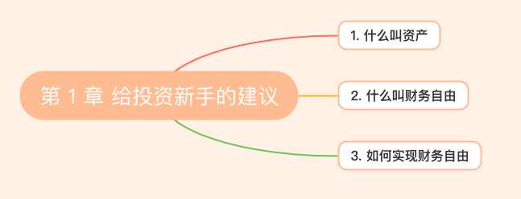
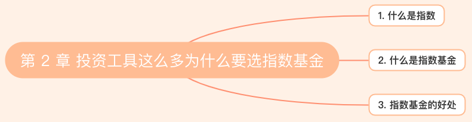

# 指数基金投资指南——学习笔记

> **What ？Why ？How ？**
>
> 因为目前自身的烦恼，**99%的问题可以通过钱来解决**。我认为自己还是一个比较传统的孩子，爸妈也没教过如何理财，就是不要买股票，不要赌博，不要轻易借钱给别人，不要给人做担保！！！我知道爸爸妈妈的能力有限，已经把他们所踩过的坑和经验告知我了。但是时代变了，我当然知道有些东西肯定是不能碰的。
>
> **我想早日实现财务自由，去做自己想做的一些事！** 所以我现在得好好学习理财！

## 第 1 章 给投资新手的建议

### 1.1 什么叫资产

能**生钱**的就是资产，例如股票、基金、房地产、理财产品等。现金不是资产，因为它不会生钱！如果我们手持现金长期不用还会贬值，所以**长期不用的现金应该用于买资产**。

### 1.2 什么叫财务自由

就算自己不工作也有额外的收入（有钱进你的口袋），可以做自己想做的事！

书本定义：**我们不用为钱发愁，同时又有足够多的时间来做自己想做的事情**。

### 1.3 如何实现财务自由

1. 让**资产**为我们打工，不断的**钱生钱**。
2. 当我们的时间不值钱的时候，可以用业务时间多读书，多锻炼身体，戒掉一些花费较高对身体无益的消费。

## 第 2 章 投资工具这么多为什么要选指数基金

### 2.1 什么是指数

> 我们一般研究一个东西的时候会看它的**走势**，比如近3年、10年的走势发展。

**指数**：是一个**选股规则**，按照某个规则选出一篮子股票，并反应这一篮子股票的走势。

比如可以通过看股票指数来看今天整体一类股票是涨还是跌。

### 2.2 什么是指数基金

**指数基金**：基金公司开发一个基金产品，按照指数的选股规则去买入完全一样的一篮子股票。

### 2.3 指数基金的好处

长生不老、长期上涨、成本低。