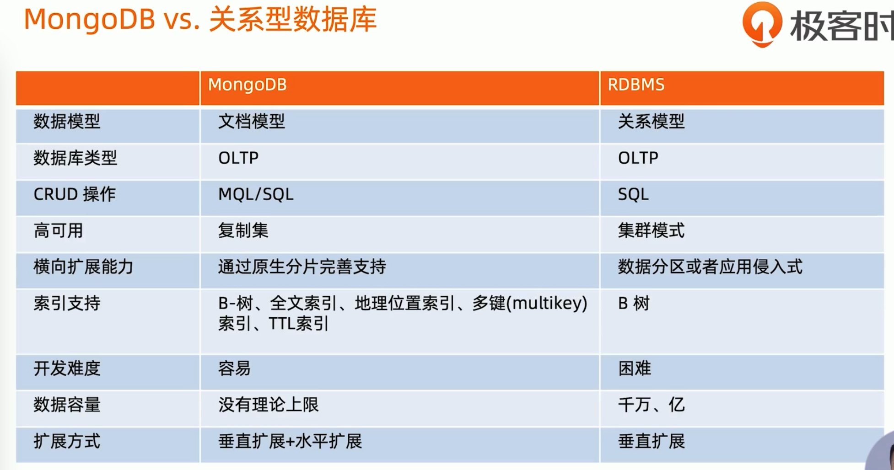
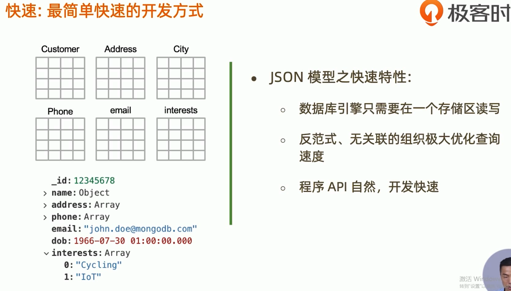
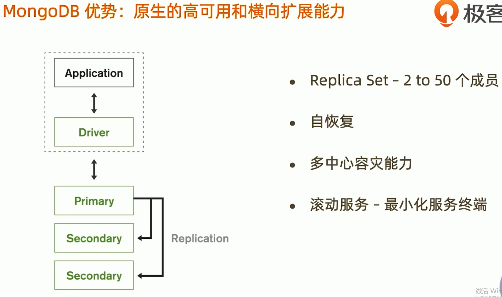
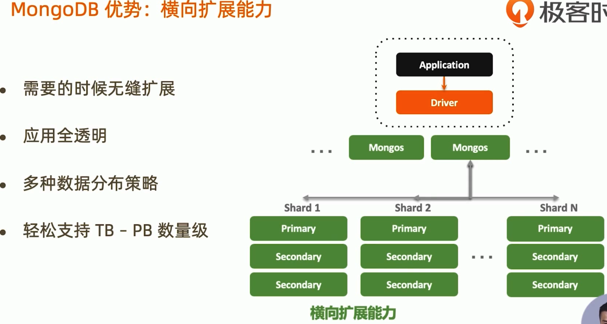

# MongoDB学习笔记

## 1. 基础知识

**MongoDB是什么类型的数据库？MongoDB的特点？**

> 1.MongoDB是基于JSON模型，鼓励更多的文档嵌套方式，来减少多表关联的设计
> 2.MongoDB是通过分片来支持横向扩张，分片的设计和调优相对比较复杂
>
> MongoDB是以JSON为数据模型的文档数据库，JSON Document。MongoDB有很强的横向扩展能力，可以支撑很大数据量和并发。

**OLTP与OLAP的区别？**

> 联机事务处理OLTP（on-line transaction processing）、联机分析处理OLAP（On-Line Analytical Processing）。OLTP是传统的关系型数据库的主要应用，主要是基本的、日常的事务处理，例如银行交易。OLAP是数据仓库系统的主要应用，支持复杂的分析操作，侧重决策支持，并且提供直观易懂的查询结果。

**MongoDB与关系型数据库的区别？**

**MongoDB特色以及优势**

**多形性**：同一个集合中可以包含不同字段（类型）的文档对象。

**动态性**：线上修改数据模式，修改是应用与数据库均无须下线。

**数据治理**：支持使用 JSON Schema来规范数据模式。在保证模式灵活动态的前提下，提供数据治理能力。

**MongoDB技术优势总结**

- JSON结构和对象模型接近，开发代码量低
- JSON的动态模型意味着更容易响应新的业务需求
- 复制集提供99.999%高可用
- 分片架构支持海量数据和无缝扩容