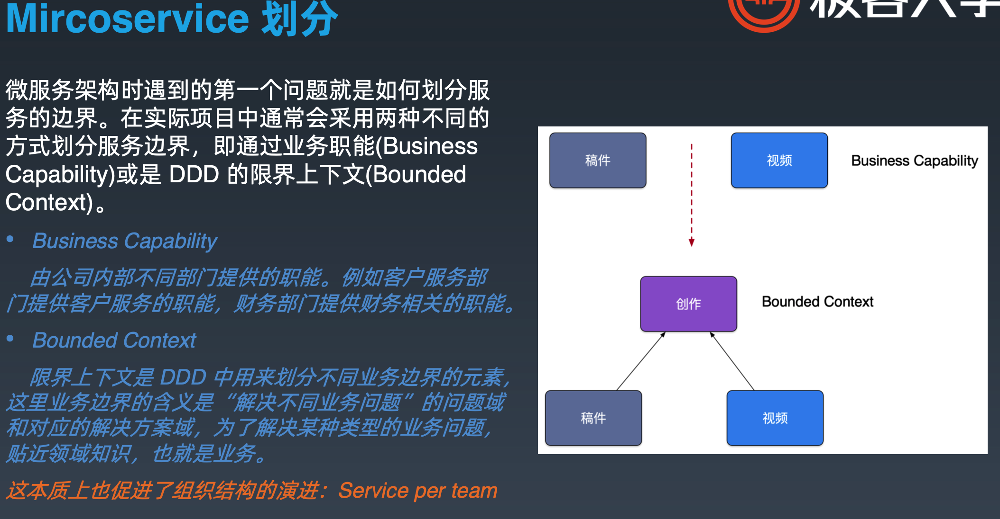
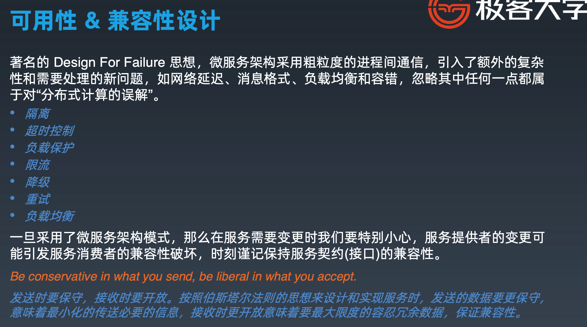
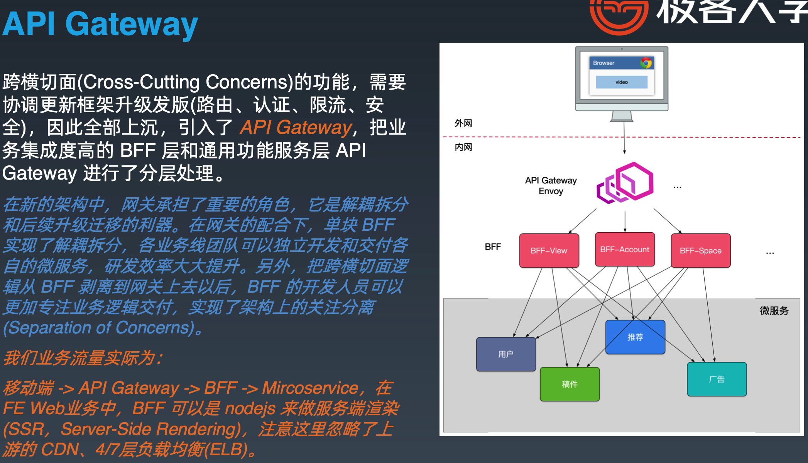
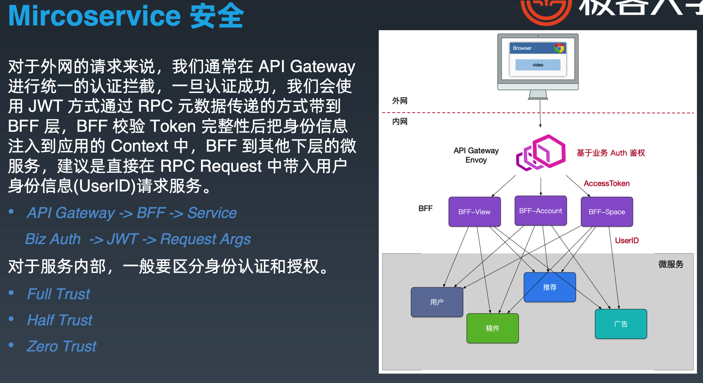
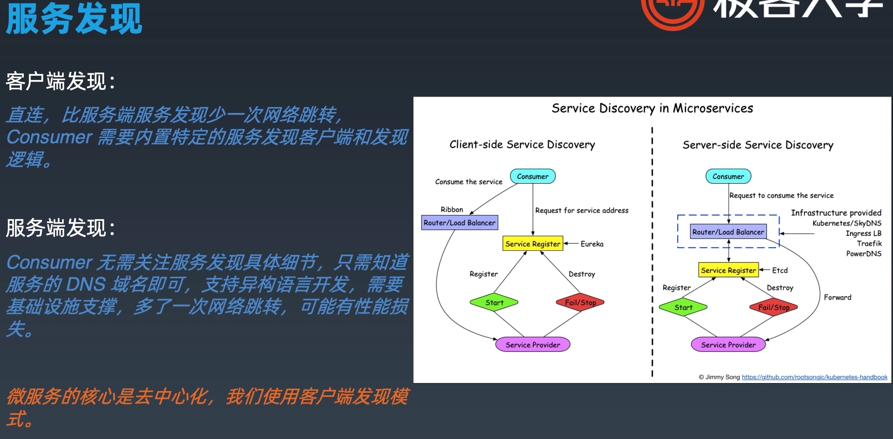
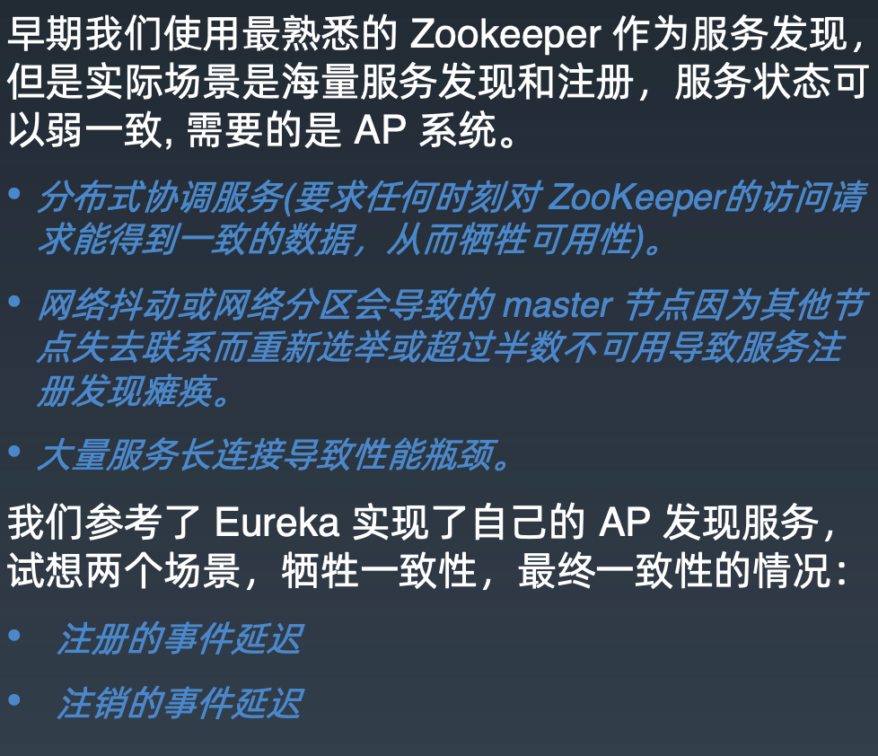
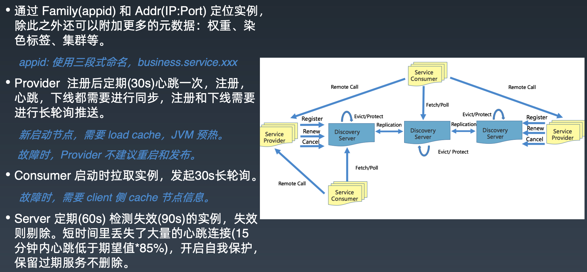
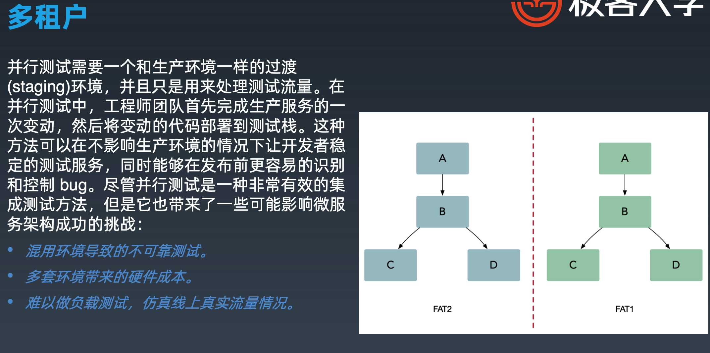
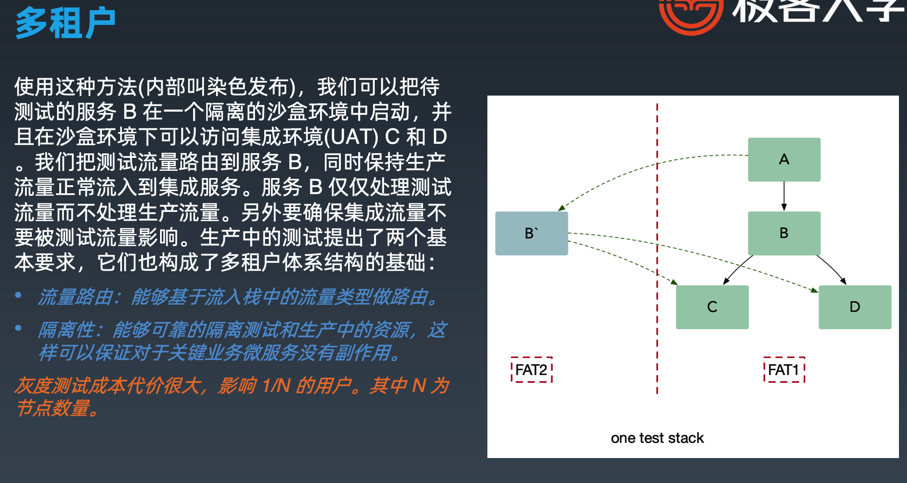

# w学习笔记

## 1. Go进阶第一课

### 1.1 单体应用

以前是单体应用，因为流量不大。但是随着访问量的增多，单体应用顶不住了就算服务器配置升级到顶配其实还是不行，顶得住双十一的流量吗？所以把花钱买顶配的服务器均分，买一定数量的性能不是特别好的服务器。再举个例子，吕布确实很厉害，大概是三国战力的天花板了，但是他干得过一个军队嘛，干不过的。所以单体应用需要微服务化。一个大的单体应用有A、B、C、D、E等功能模块，那么是如何将功能模块划分为微服务呢？如何去划分？

**采用业务职能或者DDD的限界上下文。**

### 1.2 微服务（SOA）

**特点：** 小而美、单一职责、可移植性比效率更重要。

**SOA定义**：原子服务、独立进程、隔离部署、去中心化服务治理。

**缺点：** 服务比较多，管理比较困难，复杂度高。原先单体服务服务调用很方便，现在微服务化后服务之间通信必须使用 rpc 或 消息传递，来实现进程间通信，还有时延问题；服务之间的依赖，一个服务的升级可能会波及多个服务。

**一个微服务**：kit——一个微服务的基础库（框架）；service——业务代码+kit依赖组成的业务微服务；rpc+message queue——轻量级通讯。

**去中心化**：数据去中心化、治理去中心化、技术去中心化。每个服务独享自身的数据存储设施(缓存，数据库等)，不像传统应用共享一个缓存和数据库，这样有利于服务的独立性，隔离相关干扰 。

> 去中心化，我记得之前在公众号有看到过，阿里抛弃技术中台。

**可用性 & 兼容性设计**：

### 1.3 API Gateway

### 1.4 微服务安全

### 1.5 服务发现

目前有两种服务发现，客户端发现和服务端发现。

### 1.6 多租户

