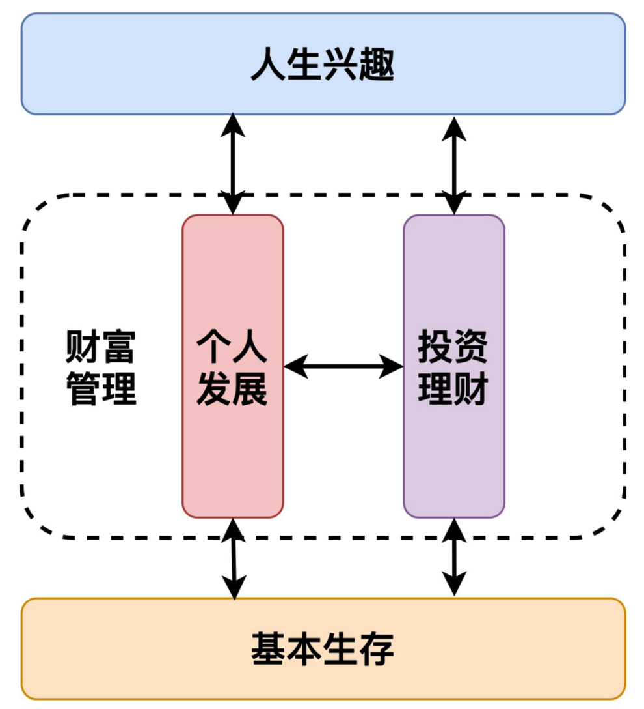

# 程序员的个人理财学习笔记

> 个人的学习笔记，记录一些心得体会！！！加油，健文！！！

## 1. 财富框架：建立属于你自己的财富双塔

双塔理论，地是个人的基本生存，天是个人的兴趣爱好，中间是个人发展以及投资理财。确实人需要先满足个人的基本生存，然后利用个人发展以及投资理财来发展个人的兴趣爱好。

文章学习到的东西：

1. 不混淆工作上的时间和财富管理的时间，作者每晚的10点到12点用于个人的发展以及理财学习。——自己就很有问题，自己常常把工作和自己发展的时间给搞混了，就弄得自己有时候工作的时候想学习，学习的时候又担心工作，确实存在问题，这个毛病需要好好改掉。
2. 做时间的朋友，保持每天短时间的投入和累积长时间的积累；
3. 坚持固定自己进行财富管理的时间，没有重大的事情，坚持雷打不动。

## 2.个人发展：你自己的发展才是最大的财富源泉

文章学习到的东西：

1. 个人发展由三个同心圆组成，从内而外是职场价值、专业延伸价值与家庭和人生价值。职场价值是只工作，专业延伸价值指你可以用工作中的学习到的东西，写博客或者出书都可以，家庭和人生价值就是我们这辈子一直追求的。
2. 外包消耗性的工作，比如扫地、拖地、洗衣做饭啥，可以给机器人或者清洁工来，这样就可以节省一些时间来提升自己能力，增加家庭的幸福感。有更多时间积累财富型资源。

## 3.理财金字塔：如何建立稳固的投资理财结构

1. 所有的投资标的可以分为四大类：固收类、股票类、实物类、新兴类。要尽力了解所有的投资标的大类，设置观察仓就是很好的了解新标的的方法。
2. 在做资产配置时，要遵循层级迭代式投资法，自顶向下地规划你的投资行为。
3. 记住永久组合的投资比例：25% 股票，25% 债券，25% 黄金，25% 货基。
4. 要时刻关注自己的大类资产是否存在失衡的情况，如果有，就要制定切实的计划去进行资产再平衡。
