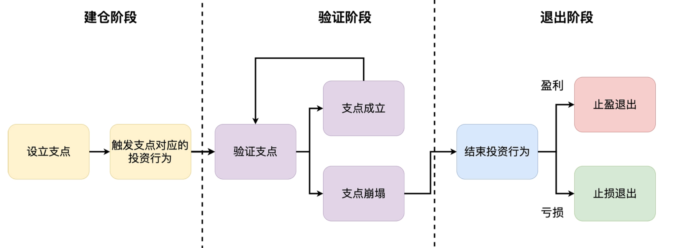

# 程序员的个人理财学习笔记

> 个人的学习笔记，记录一些心得体会！！！加油，健文！！！

## 1. 财富框架：建立属于你自己的财富双塔

双塔理论，地是个人的基本生存，天是个人的兴趣爱好，中间是个人发展以及投资理财。确实人需要先满足个人的基本生存，然后利用个人发展以及投资理财来发展个人的兴趣爱好。

文章学习到的东西：

1. 不混淆工作上的时间和财富管理的时间，作者每晚的10点到12点用于个人的发展以及理财学习。——自己就很有问题，自己常常把工作和自己发展的时间给搞混了，就弄得自己有时候工作的时候想学习，学习的时候又担心工作，确实存在问题，这个毛病需要好好改掉。
2. 做时间的朋友，保持每天短时间的投入和累积长时间的积累；
3. 坚持固定自己进行财富管理的时间，没有重大的事情，坚持雷打不动。

## 2.个人发展：你自己的发展才是最大的财富源泉

文章学习到的东西：

1. 个人发展由三个同心圆组成，从内而外是职场价值、专业延伸价值与家庭和人生价值。职场价值是只工作，专业延伸价值指你可以用工作中的学习到的东西，写博客或者出书都可以，家庭和人生价值就是我们这辈子一直追求的。
2. 外包消耗性的工作，比如扫地、拖地、洗衣做饭啥，可以给机器人或者清洁工来，这样就可以节省一些时间来提升自己能力，增加家庭的幸福感。有更多时间积累财富型资源。

## 3.理财金字塔：如何建立稳固的投资理财结构

1. 所有的投资标的可以分为四大类：固收类、股票类、实物类、新兴类。要尽力了解所有的投资标的大类，设置观察仓就是很好的了解新标的的方法。
2. 在做资产配置时，要遵循层级迭代式投资法，自顶向下地规划你的投资行为。
3. 记住永久组合的投资比例：25% 股票，25% 债券，25% 黄金，25% 货基。
4. 要时刻关注自己的大类资产是否存在失衡的情况，如果有，就要制定切实的计划去进行资产再平衡。

## 4.实战知识：有哪些收益稳健的经典资产配置组合

事实上，在财富管理的过程中，学会应用资产配置的思想，比选择具体的组合方案重要得多。即便你使用的不是这一讲提到的四种经典配置方案，只要投资者将一些相关性较低的资产类别进行组合，并用一个较为均衡的权重来分配，分散化的投资就可以大幅降低你的财富风险，让你的收益率更加稳健。

## 5. 支点投资法：主动投资是讲逻辑的！

> 支点投资法主要是，建仓，然后不断验证你的假设，在合适的时候退出。

1. 永久组合 6.8% 的年化收益其实是一个非常优秀的收益率，想要通过主动投资获得超过它的收益率，并不是一件容易的事情；
2. 要想通过主动投资真正赚到钱，就必须遵照“严谨的投资逻辑”；
3. “逻辑”和“情绪”是一对严格对立的敌人，在投资过程中，一定要避免由情绪驱使的“无效投资”和“神经错乱”现象；
4. “支点投资法”分为“建仓”“验证”“退出”三个阶段。它的大致过程是：在投资行为发生之前，先寻找一个逻辑支点。之后，随着时间的推移，不断去验证这个支点还存不存在。一旦这个支点消失，就要毅然决然地选择结束这次投资行为；
5. 止盈和止损的本质是统一的，就是在投资支点崩塌之后的退出行为。退出时盈利，则是止盈操作；退出时亏损，则是止损操作。

## 6.不当韭菜：在财富管理的过程中摆正心态，知己知彼

永远记住自己是一个普通人：

1. 这辈子我不可能靠投资就实现财务自由；
2. 我不可能是那个万中无一的幸运儿，刚开始投资就能稳定盈利；
3. 如果我在投资的时候随意操作，不讲投资逻辑，就算一时运气挣了钱，也早晚会被亏光。

**总结**：

**一个出发点**：任何投资理财的行动，都要以“你只是一个普通人”为出发点。

**三个误区**：在投资理财过程中，听信所谓投资专家的意见；期望通过频繁的短期操作来赚取更多的收益；因为惧怕投资亏损，只敢把钱放到银行。

**三个优势**：长钱优势、专业信息优势、程序员优势。

**一条补充观点**：程序员在个人发展的过程中同样要摆正心态。

## 7.职业方向：如何选择一个有前景的职业方向

1. 有前景的职业方向有两个特点，一是高度高，二是容量大。
2. 在具体找工作时，不仅要考虑长期发展，还要考虑短期供需关系的影响。
3. 选择后的坚持才是影响你收入的第一要素，因此不建议在没有规划的情况下频繁跳槽。
4. 只要满足这两个典型条件之一，就建议你转换职业方向：第一个是个人转方向的决心非常坚定，对自己非常有信心；第二个是当前职业方向进入了长期下行通道。
5. 转换职业方向，具体可以分为三个步骤：第一步，下决心，开弓没有回头箭；第二步，定目标，提前一年查目标岗位的 JD，确立详细的目标；第三步，攒经验，千方百计地向你的目标岗位靠近。

> 目前云原生领域还是不错，自己也好好坚持。

## 10.跳槽涨薪：如何规划一条合理的职业道路

1. 导致跳槽涨薪比内部涨薪快的原因主要有三个：互联网行业发展过快；内部涨薪受多种因素牵制；外部招聘的职位更有稀缺性。
2. 当一家公司阻碍你积累职场财富的时候，就可以离开了。主要有三种情况：第一，这家公司本来就是你职业道路上的一个跳板；第二，公司所在的行业出现了不可逆转的问题；第三，当前的公司已经无法给你提供任何技术财富和人脉财富了。
3. 一定要牢记，跳槽不是为了逃避问题，而是为了解决问题，要避免“无效跳槽”。
4. 在选择下一站的时候，一定要结合你的十年职业规划，做出适合你自己的决定。
5. 三个谈 offer 时的关键点：不要先离职再找工作；先拿竞争 offer；关注 offer 薪酬相关的细节。

> 谈 offer 时的关键点：
>
> 第一，永远不要离职后再去找工作。否则，在谈 offer 的时候，很容易会被新东家的 HR 压薪资和职级，在遇到挫折的时候，你的求职心态也更容易崩溃。
>
> 第二，如果你心目中有一家目标公司，那么最好先面试两到三家非首选的公司，拿到保底 offer 或竞争 offer 之后，再去面目标公司。这样做，一是可以让你逐渐进入面试的最佳状态，二是可以防止被目标公司的 HR 压职级和薪资。
>
> 第三，不要被 offer 的总价迷惑。你需要好好捋一遍 offer 薪酬相关的细节，搞清楚哪些是一定能拿到的基本薪酬，哪些是奖金甚至加班费。在总价一样的情况下，当然选基本薪酬给得多的公司，这样才能更好地保障你的收入水平。
