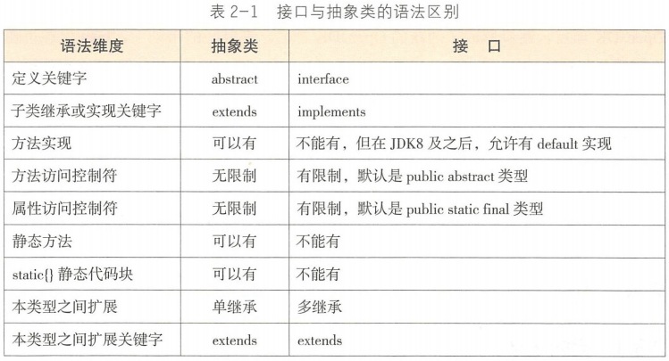
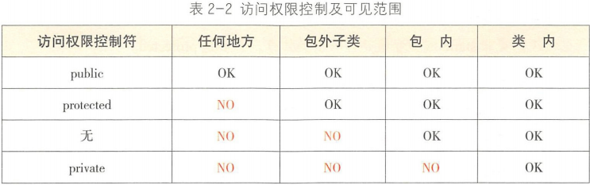
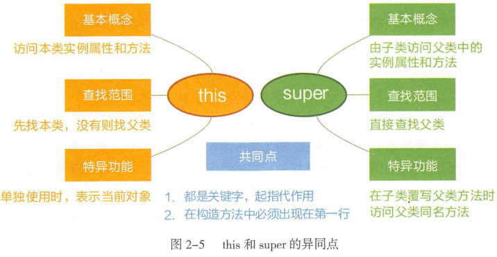

# 码出高效Java开发手册

## 第二章 面向对象

**面向对象编程和面向过程编程的区别？**

> 引用知乎网友的回答：面向过程是编年体，面向对象是纪传体

是一种**设计上的区别**，其实编程主要是利用计算机技术为了解决问题。面向过程就是分析出解决问题所需要的步骤，使用method将这些步骤一步一步实现，使用的时候依次调用 method 就行。面向对象是把构建成问题的事物分解成各个对象，建立对象并不是为了完成一个步骤，而是为了**描述某个事物在整个解决问题的步骤中的行为**。

---

**面向对象编程特征？**

封装、继承、多态。其中最重要的还是程序员的抽象能力。

封装：简单说就是将一些特性封装在对象里面，有些字段选择对外暴露有些则不选择对外暴露，针对Go语言大写则允许外面对其访问，小写则不允许。对于Java而言，一般都设置为private，并暴露get和set方法。如果字段直接使用public，未来如果想在修改属性的setter方法上进行鉴权控制、日志记录都是无法做到的。为了适配将原先的public直接改成private，再生成其get和set方法，但是这样原先依赖模块会编译出错。所以在不知道什么样的访问权限合适的时候，优先推荐使用private控制级别。

继承：是面向对象的基石。简单来说继承更多的是增加父类能力的复用。但是需要慎用继承，滥用继承会引起方法污染和方法爆炸。方法污染：比如父类是鸟，子类是鸵鸟，鸟能飞，但是鸵鸟不行，这样父类的方法在子类就不能使用了，我们不能重写父类的方法或者抛出异常不让使用。方法爆炸：继承树不断扩大，底层类拥有的方法虽然都能执行，但是由于方法众多，部分方法并非与当前类的功能定位相关，容易在编程中产生选择困难症。提倡使用**组合优先原则**来扩展类的能力即优先采用组合或聚合的类关系来复用其他类的能力，而不是继承。

多态：是面向对象特性的基础，根据运行时的实际对象类型，同一个方法产生不同运行结果，使同一行为具有不同的表现形式。override：重写或覆写，垂直方向上行为的不同表现。overwrite：重载，水平方向上行为的不同表现。**编译期间就能确定方法的调用，属于静态绑定**。多态是指在编译层面无法确定最终调用的方法体，由于override在运行期由jvm进行动态绑定，调用合适的覆写方法体来执行。多态严格意义上来说是一种由继承行为衍生而来的进化能力而已。

---

**类里面成员和方法怎么展示布局？**

1. 成员
2. 公共方法
3. protect方法
4. 私有方法
5. get/set方法

---

**抽象类和接口的区别？**

抽象类是模板式设计（类似某个品牌的车、手机等运动版、豪华版，pro，promax），而接口是契约式设计（刹车接口，任何车都必须具备刹车能力）。

当定义纠结使用接口还是抽象类时，**优先推荐定义为接口**，遵循接口隔离原则，按某个维度划分成多个接口，然后再用抽象类去implements某些接口，这样做可方便后续的扩展和重构。

---

**访问权限控制？**

在重构的时候，如果是private方法过旧，可以直接删除，但是对于public方法时，想要删除就得注意！！！需要谨慎又谨慎地检查是否被调用。变量就像自己的小孩，要尽量控制在自己的视线范围内，如果作用域太大，无限制乱跑，就会担心其安危。

1. 如果不允许外部直接通过new创建对象，构造方法必须是private。
2. 工具类不允许有public或default构造方法。
3. 类非static成员变量并且与子类共享，必须是protected。
4. 类非static成员变量并且仅在本类使用，必须是private。
5. 类static成员变量如果仅在本类使用，必须是private。
6. 若是static成员变量，必须考虑是否为final。
7. 类成员方法只供类内部调用，必须是private。
8. 类成员方便只对继承类公开，那么限制为protected。

---

**this vs super？**

---

