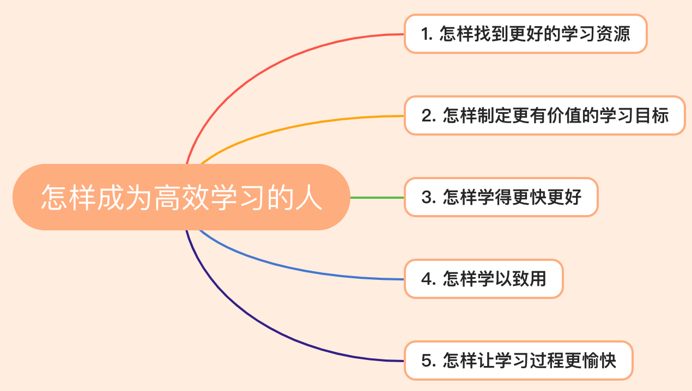

# 脱不花-怎样成为高效学习的人

> 最好的学习方式——**任务式学习**：用真实的任务、项目、目标来牵引自己的学习。

## 1. 怎样找到更好的学习资源

1. 搜索
2. 使用专业平台比如得到
3. 最推荐：**跟人学**

跟人学：**三级导师制**——入门、进圈和拜佛

1. 先问入门级导师2个问题：这一领域最牛的人以及这个领域最值得看的书。
2. 通过了解行业牛人的一些信息，进入圈内。
3. 通过一些大会等活动去接触行业牛人。

遇到行业大牛得提出**好问题**

1. 请问在像您这样的专家心目中，您这个领域公认的大神是谁？
2. 我特别遗憾，我一直没有机会系统地去学，您这个领域的知识。我四十多岁了，想从现在开始学起，那在入门阶段，您推荐我读哪本书？
3. 老师，我想在大学毕业之后从事投资工作。您是做投资的，您觉得从事这一行业基本能力的要求是什么？我应该从哪开始作准备？
4. 老师，从事这个行业，您觉得最关键的环节有哪些？您都遇到过哪几个重要挑战？您是怎么过来的？
5. 在您这个领域，您觉得一般人和高手之间最大的区别是什么？
6. 如果您要带一个徒弟，您会重点教他关注哪几个魔鬼细节？为什么是这几个细节特别重要？
7. 老师，最近好长时间没见了，最近半年您觉得有什么问题、什么新闻或者哪本书，是对您触动特别大的吗？
8. 最近你们行业发生了一件XXX大事，您能帮我分析分析，这背后到底是怎么回事吗？
9. 老师，我现在此时此刻已经在做一件什么事。这个事，我有个难点一直没想明白，能不能请您给我指点一下？
10. 假如，此刻是你生命的最后十分钟。你有个机会，可以给这个世界留下一段话，说说你自己这个专业。请问你会说什么？

## 2. 怎样制定更有价值的学习目标

合理的学习目标包含的四个条件：1、有场景；2、有距离；3、有抓手；4、有阶梯；

**有场景**：有某个地方能验证它。

**有距离**：目标得与你的现状有一定的距离，**跳一跳才能够得着。**

**有抓手**：

第一，**开始和结束的时间**。
第二，具体的**执行动作**。比如你说我要减肥，它就是一个抽象的动作。但你说我今天晚上不吃晚饭，这就是个具体的动作。
第三，执行动作的**数量**。比如我要多读书，就没有数量，要把数量定下来，比如每天读五页书。
第四，执行动作的完成度。从一开始就明确，到什么程度，这个动作算真的完成，避免糊弄自己。

**有阶梯**：第一阶梯什么样，第二阶梯什么样，要有不同，也要有递进。比如学英语：第一阶梯——日常会话；第二阶段——读懂英文报纸；第三阶段——看懂不配字幕的美剧；第四阶段——用英文发表一个十分钟演讲。

把目标按**从易到难排序，先把简单的实现**。

## 3. 怎样学得更快更好

## 4. 怎样学以致用

