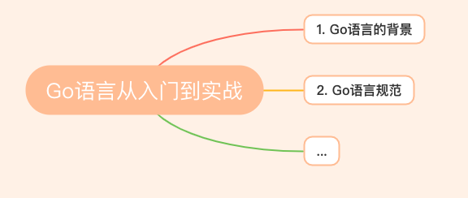

# Go语言从入门到实战

## 1. Go语言的背景

> 创建Go语言的目的、主要创始人、Go语言的命名由来、Go语言的特点、使用场景等

[Go语言的背景](https://blog.csdn.net/u013164931/article/details/113856773?spm=1001.2014.3001.5501)

## 2. Go语言规范

[Uber Go Style Guide](https://github.com/uber-go/guide/blob/master/style.md#import-group-ordering)

## 3. Go相关知识点

### 3.1 运行

> 如何运行 ？

