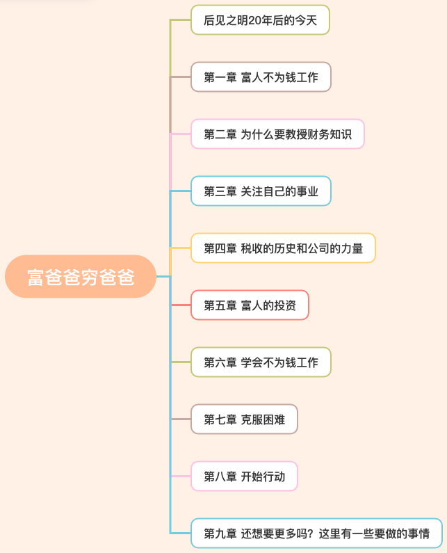

# 富爸爸穷爸爸

> 这本书时看一些理财学习到的，大概知道就是两个爸爸不同的赚钱思维

## 后见之明20年后的今天

1. 对于金钱的认识不是来自学校，而是来自家庭，在学校只教我们好好学习，但是没有教我们**理财方式和思维习惯**。
2. 破产和平穷的区别：破产是短暂的，平穷是永久的。
3. 要让钱为我们工作。

## 第一章 富人不为钱工作

1. 生活是最好的老师，大多数时候，生活不会和你说什么，它只是推着你转，每推一次，它都像是在说：“喂，醒一醒，我要让你学点东西。”
2. 要学会专注，如果事情必须改变，首先改变的就是我自己，改变自己比改变他人更容易。
3. 学习怎样让钱为你工作是一个持续终生的过程。
4. 忠实于你的感情，以你喜欢的方式运用你的头脑和感情，不要让它们控制你。
5. 造成贫困和财务问题的主要原因是恐惧和无知，在学校里从来没有告诉学生如何处理金钱和恐惧。
6. 恐惧把你推出门外，欲望又开始召唤你，这就是陷阱。
7. 当情感占据上风时，理智就会下降。
8. 要学会看见别人看不见的东西。

> 读书感悟：在学校里只会教你好好学习，并不会教育你理财和一些思维，反而更多的从父母那边获取到相关知识。要保持专注，改变自己比改变他人容易许多。理财是一辈子的事情！

## 第二章 为什么要教授财务知识

1. 你挣了多少钱不重要，重要的是你**留下了多少钱**。
2. 我们有太多人过多地关注钱，而不是关注他们最大的财富——所受的教育。如果人们能灵活一些，保持开放的头脑不断学习，他们将在时代的变化中一天天地富有起来。
3. 如果你想要发财就得学习财务知识。
4. KISS（keep it simple stupid 或 keep it super simple）。
5. **资产是能把钱放进我的口袋，负债是是把钱从我口袋里取走**。
6. 一个受过高等教育且事业有成的人，同时也可能是财务上的文盲。这种人往往太过努力地工作，因为他们只知道努力工作，却不知道如何让钱为他们工作。
7. **最大的损失是致富机会的损失**。
8. 退休计划已经不再是老年人和退休人员的避风港。
9. 竭尽全力买入能带来收入的资产，这是你走上致富之路的最好办法。
10. 比钱更重要的生存之道是我们所受的教育和学习的能力。
11. 孩子们从学校毕业时几乎没有学习到有关财务的知识。

> 读书感悟：要不断买入资产，钱生钱。抓住致富的机会。

## 第三章 关注自己的事业

1. 你事业的重心是你的资产项，而不是你的收入项。
2. **只有把你额外的收入用来购买可产生收入的资产，你才能获取真正的财务安全**。
3. 对成年人而言，把支出保持在低水平、减少借款并勤劳地工作会帮你打一个稳固的资产基础。
4. **先构建资产项，通过资产项的收入购买奢侈品**。
5. 花时间投资并创建自己的事业之后，就准备好迎接那个富人的最大秘密。
6. **保持低支出，降低负债，为坚实的资产打造基础**。
7. 富人最后才买奢侈品，而穷人和中产阶级会先买奢侈品。

> 读书感悟：保持低支出，购买资产，通过购买资产赚取的钱来购买奢侈品。

## 第四章 税收的历史和公司的力量

1. 税收一开始是针对富人的，后面随着政府扩大，需要更多资金，现在纳税的重担还是在中产阶级上面。
2. 富人通过**开公司**来逃避税收，他们会聘用熟知法律的精英，因为聘用他们的钱比缴税交的钱少。
3. 富人通过开公司进行收入、支出、缴税；打工人是收入、缴税、支出。
4. 税收只会惩罚穷人和中产阶级自己，因为他们缺少财务知识，无论“劫富”的呼声多高，富人总有办法从中脱身，因为他们明白钱的力量，这是学校不曾教过的科目。

## 第五章 富人的投资

1. 最大的资产不是钱，而是一个人的**脑子**。
2. 财商是由这4项主要技能组成的：会计、投资、了解市场、法律。
3. 如果你把钱投进一笔交易然后只是祈祷，才是在赌博。
4. 风险越大，收益越大，所以你需要提升财商，这样你面临的风险就越低。你越精明，你越能应付意外情况。
5. 好机会使用你的脑子而不是用你眼睛看到的。

## 第六章 学会不为钱工作

> 通过阅读了解到本章节主要教导多学习，要学习各方面的知识，要形成一个体系。当然本行的技术是要过硬。

1. 成功必备的管理技能包括：对现金流的管理、对系统的管理、对人员的管理、最重要的技能是销售和对市场营销的理解。
2. 年轻人在找工作时要看能从中学到什么，而不是只能看挣多少钱。
3. 你终日忙碌的目的是什么？

## 第七章 克服困难

> 通过阅读本篇文章了解到，很多人遇到困难，挑战还是会退缩、逃避。很少有人在别人恐惧的时候我开心，就相当于在股市中，你周边的人都叫你走，或多或少会影响你。

1. 我们在某些方面是英雄，在另外一些方面缺可能是懦夫。
2. 如果你讨厌冒险，担心会亏钱，就早点动手积累资产吧。
3. 对于大多数人来说，他们在财务上不成功是因为对他们而言亏钱所造成的痛苦远远大于致富所带来的快乐。
4. 接受失败的现实并把它转变成通向成功道路上的一次次鼓励。
5. 失败会**激励胜利者**，击垮失败者。这是胜利者最大的秘密，也是失败者所不知道的秘密。
6. 如果你有致富的愿望，就必须集中精力。把你大部分的鸡蛋放在较小的篮子里，并集中精力；坚持一种投资战略，直至成功。
7. 大部分人之所以贫穷，是因为他们想要投资的时候，周围到处是跑来跑去的“小鸡”，叫囔着“天要塌下来了，天要塌下来了”。
8. 怀疑和恐惧使我们采取保守策略，所以我们总是与机会失之交臂。
9. 一个精明的投资着知道，看起来最糟糕的时期实际上正是赚钱的最佳时机。当其他人都害怕采取行动，精明的投资着缺开始行动获得回报。
10. 掌握财务知识的人有时候还是不能积累丰厚的资产项，其主要原因有5个：1、恐惧；2、愤世嫉俗；3、懒惰；4、不良习惯；5、自负。

## 第八章 开始行动

> 通过阅读文章作者给力10个步骤。

1.找一个超现实的理由——精神的力量。有发自内心深处的精神动力，当遇到一些困难就不会退缩。

> 之前在虎扑上有看到的，如果提前2年给你清华的录取通知书，但是有个要求就是每天得学习 2 小时，做一张试卷，这样绝大多数人能坚持下来。到后面及时你不给你录取通知书你也很有可能考上清华。

2.每天做出选择——选择的力量

> 许多富裕的家庭之所以“富不过三代”，就是因为他们没有培养出一个在行的人来管理资产。
>
> 第一是时间，这是你最珍贵的资产；第二是学习，正是因为你没有钱，就更要去学习。
>
> 大部分人选择的是直接去投资，而不是投资于学习如何投资。
>
> 需要保留自己的思考方式，以长远的眼光看待我的财富。
>
> 上帝为什么给我们两只耳朵一张嘴巴。

3.谨慎的选择朋友——关系的力量

> 物以类聚，人以群分。
>
> 在积累财富的过程中，最困难的事情莫过于坚持自己的选择而不盲目从众。

4.掌握一种模式，然后再学习一种新的模式——快速学习的力量

5.首先支付自己——自律的力量

> 是否自律是将富人，穷人和中产阶级区分开来的首要因素。
>
> 穷人有一些不好的习惯，其中一个普遍的坏习惯就是随便动用**储蓄**。**富人知道储蓄只能用于创建更多的收入**，而不是用来支付账单。

6.给你的经纪人以优厚的报酬——好的建议力量

> 一位好的经纪人不仅应该给你提供信息，还应该愿意花时间来教导你。

7.做一个“印第安给予者”——无私的力量

8.用资产来购买奢侈品——专注的力量

> 用消费欲望来激发并利用我的理财天赋去投资。
>
> 记住，轻松的道路往往越走越艰难，而艰难的道路往往越走越简单。

9.对英雄的崇拜——深化的力量

> 比如打篮球，你上场就把自己看作是科比，这样你很大概率会打的很好。

10.先予后取——给予的力量

> 慷慨一些，记住自己想要的东西先付出，然后才能得到加倍的回报。

## 第九章 还想要更多吗？这里还有一些要做的事情

许多人愿意去做而不愿意思考，也有许多人愿意思考而不愿意付诸行动

1. 停下你手头的活儿。——不要做那些无效的事情，找一些有效的事情去做。**少刷手机**。
2. 寻找新的思想。
3. 找一些做过你想做的事情的人。
4. 上辅导班、读书或参加研讨会。——有时候付费内容还是非常好的。
5. 提出多份报价。
6. 每月在某一地区慢跑、散步或驾车 10 分钟左右。
7. 购买特价商品。——比如中概股。
8. 关注适当的地方。
9. 首先寻找想买进的人，然后才去找想卖出的人。
10. 考虑大生意。
11. 学习前人经验。
12. 行动的人总会击败不行动的人。

> 金钱是一种观念，如果你想要更多的钱，只需改变你的思想。
>
> 穷人的工作模式是劳动性收入。
>
> 富人的工作模式是投资组合收入、被动收入。
>
> 实现财务自由的关键取决于一个人将劳动性收入转化为被动收入或投资组合收入的能力。
>
> 上天赐予我们每个人两样伟大的礼物：思想和时间。你可以运用这两件礼物去做你愿意做的事情。每一美元钞票到了你的手中，你，且只有你，才有权利决定自己的前途。愚蠢地用掉它，你就选择了贫困；把钱用在负债项上，你就会成为中产阶级；投资于你的头脑，学习如何获取资产，富有将成为你的目标和你的未来。每一天，面对每一美元，你都在做出自己是成为一个富人，穷人还是中产阶级的抉择。

---

## 读后感

通过全文后了解到富爸爸穷爸爸的两种思维模式，今天有看 morty 老师的课程《普通人如何打破命运？我送你一把改变未来的钥匙》穷爸爸这个模式更加贴近人性，因为**大脑更想要的是更快的奖励，安全，耗能少**。穷爸爸的收入只是劳动收入，而富爸爸则利用钱给你工作赚钱，工作模式是投资组合收入&被动收入。一些该花的钱还是要花，因为时间也是成本，好的课程能帮助你很多。其次就是要减少无效的活，比如少刷手机。突然觉得我父亲和翰林父亲就是一个穷爸爸和富爸爸思维。下次得和他父亲多交流一下，提升提升自己。还有就是做一个选择目光放长远一点，长期来看。morty老师讲的因果论，以前的一些行为影响现在，那么现在也会影响未来，所以要花时间提升自己的内在价值，还有就是人的时间和精力是有限的，一些无用的事情应该少去做。要坚持，一些事情需要花长期的时间才能看到效果，比如健身。显意识是经过理性判断去做，潜意识则是形成习惯了。不过人性的一些东西是可以锻炼的，比如morty老师做一些决定是从3年来看。

**计划**

1. 每个月1w，用于储蓄。5k用于理财，5k用于生活。
2. 9月底将花呗关闭，控制一些无效的支持，开始省钱。

