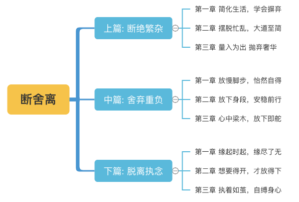

# 断舍离

> **前言**
>
> 断 = 断绝不需要的东西，不买不收、不取；舍 = 舍弃堆放在家里没用的东西；离 = 脱离对物品的执念，了解自己的真正需要，创造从容自若的自在空间。
>
> 成功很简单，一个简单的想法，一个简单的问题，一个简单的计算，往往都会导向成功。
>
> 我们要把并不容易面对的生活当成一种内心的展望与当下的体会，摆脱那些狭隘的束缚，找到适合自己的人生轨迹与速度，不浮躁，不悲观，不固执，不牵绊。
>
> 正所谓缘起时起，缘尽了无，唯有如此才能享受到人生大自在。

## 上篇 : 断绝繁杂

### 第一章 简化生活，学会摒弃

1. “人有悲欢离合，月有阴晴圆缺。”
2. 我们的生命就如同一次旅行，背负的东西越少，越轻便，越能发挥出自己的潜能与优势。
3. 适当修剪欲望。其实就是在为人生做减法。
4. 当我们减少一次应酬，就增加一份家人的亲情与生活的从容；减少一次骄奢淫逸，就增加一份灵魂的纯净与人生的宁静；减少一次谄媚邀宠，就增加一份人格的尊严与心灵的轻松。做到有舍、有礼节、有度量、有分寸，这非平常心者不可得。它不是保守退让，不是消极避世，更不是无所作为，而是一种选择、一种智慧。
5. 当外在的物质财富达到一定程度时，或者说超过所能享受的程度时，我们就不要再一味地追求和索取。否则，只会被表面的浮华所拖累。我们需要用好人生的减法，使自己达到返璞归真的境界。

### 第二章 摆脱忙乱，大道至简

1. 越是真理就越简单。
2. 简单是一种境界，只有经过一番苦练才能够达到。简单做人也是一种境界，一种比复杂的人生更高的境界。
3. 其实幸福很简单：不要勉强自己去做别人，做好自己即可。只有这样，找准自己的定位，深刻地剖析自己，才不致好高骛远，找不到前进的方向，最终把自己弄得心力交瘁。
4. 其实我们做的每一件事都是在得失之间作抉择，只要拥有一颗平常心，多留一些时间和精力做自己喜欢的事，让人生少留一些将来无法释怀的遗憾，抛去名利，放开权欲，用简单的心走过自己轻松而快乐的人生，若干年后，当我们再回味起来，就不会感到寂寞，亦不会牢骚满腹，怨天尤人。
5. 当你想和某个人靠近时，不知不觉间会以自己喜欢的标准向他提出要求，而这样的要求对对方而言，也许会感到难受，甚至是反感。
6. 学会抓住生活、工作中的本质和重心，以四两拨千斤的方式，去除掉世俗浮华的拖累。我们一天天长大，随着年龄、阅历的增加，心也变得不似从前那般单纯，本应简单的生活也过得越来越复杂，其实这些变化都源自于内心不断膨胀的欲望。
7. 我们能在繁杂的社会中用心发现一些简单的幸福，也就能够了解到什么样的生活才是真正的充实，什么样的感情才会让我们心生幸福。
8. **心以诚相待，用最初始的那份感情去珍惜**，降低对亲人和朋友的要求，减少对他人的不满与怨怼，这样我们就能让自己的生活回归简单，让自己在繁杂之中感受到轻松。
9. 坚守自己的内心原则，不为外物所累，不为他人所扰，不为物欲所伤，享受生活原本的快乐，扫去心灵因蒙受太多世俗而落下的尘埃。
10. 思索哪些东西才是必需品，哪些则是可以舍弃的。
11. 简单的生活，就是该做什么就做什么，不该做的坚决不做，能够如此这般，便能够享受真正的快乐人生了。

### 第三章 量入为出，抛弃奢华

1. 一般的花销应量力而行、精打细算，不可勉强、铺张，要把事情办得十分体面，收到又好又省的效果。
2. 依靠超过能力的消费来维持面子是不可取的，一旦事情的真相被揭穿，反而会更加难堪。
3. 当你抛弃时尚，返璞归真的时候，曾经丢失的内心的淡然与宁静，也会悄悄地回到你的身边。
4. 人们的生理需要是有限的，可社会欲望是无休止的，现代大多已成为欲望的奴隶、商品的奴隶。
5. 如果你曾经或者正在挥金如土，那么从今天起，在生活和工作中应该学会做到量入为出、勤俭朴素。
6. 只买对的，不买贵的。
7. 花三分之一的钱购买经典名牌，而且大多都在换季打折时买，这样可以至少省一半的价钱；另三分之一的钱购买时髦的大众品牌，使人可以紧跟形势，形象不至于太过沉闷；最后三分之一的钱花在购买便宜的无名服饰上，完全按照自己的审美观去选择。
8. 新节俭主义崇尚简单，但它不以牺牲生活质量，减少生活内容，降低人的欲望为代价，而是**砍掉多余的枝枝蔓蔓**，活出生活的本真。

## 中篇 舍: 舍弃重负

### 第一章 放慢脚步，怡然自得

1. 有些时候该放下脚步走得慢一点，欣赏身边的美景，**珍惜身边的人，品味生活的美好**。
2. 岁月可以带走我们的青春，皱纹可以爬上我们的脸庞，但带不走的是我们对生活的热爱、对明天的期待，日子除了柴米油盐，还有诗意的存在。
3. 曾经在幽幽暗暗反反复复中追问，才知道平平淡淡从从容容才是真。
4. 真正的平淡包含着很多内容，是透过表面现象看到的真实和质朴，是情感和理智最终永恒的和谐，是一种**知足常乐**的智慧。
5. 其实生活中不是缺少美，而是缺少发现美的眼睛；生活中也不是缺少幸福，而是缺少用心体会幸福的人。我们之所以常常感到不幸，往往都是被名利遮住了双眼，以至于无法发现它的真实存在。
6. 平平淡淡会给人们带来一份轻松、一份平静；平平淡淡会让人们拥有一份充实的人生，只要我们懂得“岂能尽如人意，但求无愧我心”，不以物喜，不以己悲，保持一份平和，保持一份从容，人生一定会平实而恬静。
7. 其实，我们如果想要享受生活，就必须向圆环学习，适时放慢生活的脚步，轻松地放飞自己的心灵。在不紧不慢的前进中会发现，身边的很多事物都是最美的风景。
8. 如何做回自己的主人才是最重要的事情。我们想走的时候走，想停的时候停，随心所欲地发现乐趣和值得珍惜的东西。既然有机会来到这多姿多彩的世界，就应该像一个旅行家，不仅要跋山涉水走完我们的旅程，更要懂得欣赏与流连。走的时候，是为了达到另一种境界；停的时候，是为了欣赏人生。
9. 夏去冬至春复来，人间正道是暖阳“。心若静，尘自飞；心若安，尘自乱。如此，无尘的心便可轻上天堂。

### 第二章 放下身段，安稳前行

1. 看透别说透，在人与人的交往中，有些事情不必弄得太过明白，只要大家心知肚明就可以了。
2. 直率、坦诚在面对不同的场合、不同的人，就要用不同的讲话和沟通方式，做到话到嘴边留三分，就能避免说话直、伤人或产生歧义。
3. 话到嘴边留三分，既给自己留下余地，也给别人留下空间和面子，才能起到余音绕梁的效果。
4. 低调说话，是一种态度，也是一种智慧，更是对人的尊重！
5. **考虑对手的心情和体面**。
6. 富者能忍保家，贫者能忍免辱，父子能忍慈孝，兄弟能忍义笃，朋友能忍情长，夫妇能忍和睦。

### 第三章 心中梁木，放下即舵

1. 能够放下的人，就是有智慧的人，只有放舍了尘根，才能做到万里行游而心中不留一念，漫步云端而世事无所牵系。
2. 放不下自己是没有智慧，放不下别人是没有慈悲，每一个人都要懂得放下自己一马，也要放别人一马，不要把生命浪费在钻牛角尖上。
3. 人生有两件事最需要智慧：一是选择，二是放下。
4. 放下不是不要，而是另一种选择。生命的路很长，很宽敞，放下才能让生命如诗如画。
5. 每个人的宽容，解放的是自己，救赎的也是自己。
6. 事实上，我们每个人都要学会放弃人生道路上遭遇的痛苦、孤独、寂寞、灾难等过去的事情，让自己能轻装前进。
7. 生命是一次长途旅行，只有勇于舍弃那些无价值、多余的东西，才能让自己获取轻松和快乐。不要揪住曾经的痛苦不放，一切事物，不管孰好孰坏，过去的都是过眼云烟，历史不能重新开始，再一次提起就是再一次伤害。为过去哀伤，为过去遗憾，除了劳心费神、分散精力之外，没有任何一点裨益。同时，我们也不要预料未来的痛苦，对未来的担忧只是一种杞人忧天的多虑，因为未来还没有到来。
8. 你虚度的今天，正是昨天死去的人们无限向往的明天。所以，不要把应该有所作为的今天徒然消耗在执念上。
9. 学会选择，懂得放弃，人生才能如鱼得水。选择是一种量力而行的睿智与远见，放弃是一种顾全大局的果断和胆识。人生的真谛，便在取舍之间。只有学会选择，才能拨开生活的重重迷雾，心清目明，找到属于自己的人生方向；只有懂得放弃，才能卸下人生的种种包袱，轻装上阵，迎接生活转机，安然度过风雨。
10. 有人觉得压力大、烦恼多、不愉快，这正表明在自己的精神生活中背负着许多不必要的“灰尘”，使人对生活和工作倍感辛劳而了无生趣。
11. 人生何需太多行李！不是指人生无所事事、没有责任，只是行李愈少，愈能仔细体会旅途中的快乐与辛酸。人生是一段旅程，负担愈轻、学会放下愈多东西的人，才能在生命的转弯处发现惊喜与机会。

