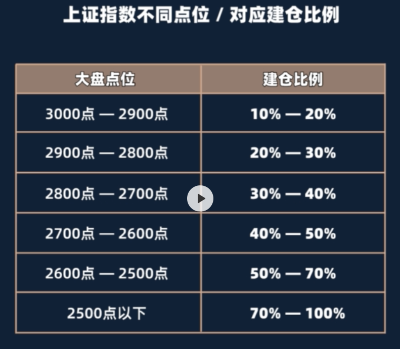
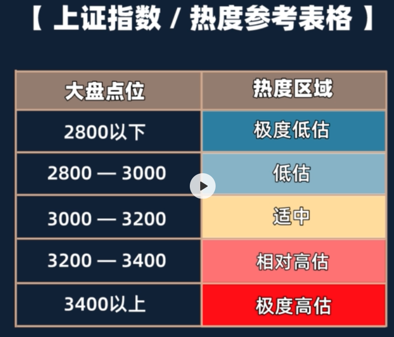

## 1. 财富起点.基金的世界

债券基金：分为短期和长期，年化收益率在 6%～8%

货币基金：银行存款、国库券、短期债券，特点是可以随时取出，年化收益率1.5% ～2% 

股票基金：主动型和被动型，主动型基金经理去做，被动型指数基金，年化收益：10%～15%

混合基金：偏股、偏债；年华收益率：9%～14%

绝大多数人不适合购买股票基金，无法拿捏评估好一家公司的未来。

**国家通货膨胀率：5%～7%左右**

如何通过理财跑赢通货膨胀！

---

## 2. 认识股市.建立正确的投资观

### 1. 了解股市规律

上证指数就是大盘用来反映市场的，整体涨跌走势。

过年 A 股的走势——熊长牛短。

### 2. 定投盈利的底层逻辑

通过定投微笑曲线来获取盈利。

### 3. 正确规划收益

年化收益率——长期、稳定

**不要想着去做赚的最多的那一个而是要做赚到的那一个。**

我们需要1、需要忍受短期的涨跌波动；2、克制住内心的贪婪。

恐惧、贪婪是最大的两个敌人。

## 3. 走进指数的世界

### 1. 认识所有指数的类型

指数：**选股规则**。比如上证50:在上海证券交易所里，选取前50家，规模最大流通性最好的公司的股票集合。

**宽基指数**: 1.要包含十支以上的股票；2.指数里的公司，都来自不同行业的。特点：风险分散，比较稳，建议配1～2支。

**行业指数**: 1.要包含十支以上的股票；2.指数里的公司，都来自同一个行业的。比如白酒指数、医药指数，相比宽基指数，收益更高，风险波动也更大。

**市值加权型指数**：根据成分股的大小，进行不同比例的加权。特点：收益和波动都是相对稳定，同样属于稳健型。

**策略加权型指数**：根据特定的策略去选股，并进行加权。通过股息率进行加权、通过公司价值进行加权、通过基本面进行加权、采用低波动进行加权。

### 2. 认识基金的名称

基金公司的名称+投资方向/风格+基金类型+字母后缀。

字母后缀：A、B、C。购买基金需要申购费（0.1%～0.15%）以及赎回费（0.5%）。

A 类:收取申购费和赎回费，持有时间越长，赎回费越低，持有时间超过2年后，就会免除赎回费。

B 类:不收取申购费，只收取赎回费，持有时间越久，赎回费越低。

C 类: 没有申购费和赎回费，但每年都会收取 0.2%～0.5%的销售服务费。

以上的所有基金，持有不到七天会收取 1.5% 的惩罚费用。

1年内的投资，选择C类；长期投资选择A类。

## 4. 开始挑选优质回报的指数基金（宽基/策略）

> 蓝筹股：指股票市场里、业绩优秀，成交活跃规模和效益都非常好的大公司的股票。

【上证50】投资超大公司的指数，特点：稳。

【沪深300指数】在上海和深圳两家交易所里选取前300家规模最大的公司股票，占 A 股的 60%，更能反映 A 股情况 。上证50相当班级排名前5名，沪深300相当于班级排名前30名。

【中证500指数】从上海和深圳两家交易所里面选取从第301—800名的，500家最大公司集合。主要投资中小型企业。

【红利指数】在整个市场挑选股息率最高的一批公司。特点：**收益稳定、每年持续获取现金收益**。上证红利今年5.34%，中证红利今年4.58%。**红利指数可以用来做养老投资**。目前比较好的三支：1、上证红利（大公司为主）；2、中证红利；3、红利机会。

【基本面指数】基本面是用来评估一家公司好坏的综合指标。有净收入/营业收入/现金流/分红。基本面50、基本面60、基本面120、基本面200。

【价值类指数】选取，市盈率、市净率、市现率低然后股息率高的股票。

【低波动指数】选取股价波动率低的股票。中证500低波动。

【创业板指数】中小型公司。容易暴涨暴跌，不建议新手。

> 主板：对公司规模，盈利能力，现金流等各项指标要求非常严格在主板上市的基本都是大型企业。
>
> 创业板：上市门槛低，多数为中小型企业。

## 5. 开始挑选优质回报的指数基金（行业/主题）

### 1. 认识所有行业的分类

**10个一级行业**

**金融**: 银行，证券、保险

**医药**: 医疗保险、医疗产品、药品生产

**材料**: 化工，造纸，钢铁，煤矿

**能源**: 石油、天然气开采，能源设施

**工业**：交通、建筑、航空航天

**信息**：硬件、软件、通讯设备

**电信**：电话，通讯，无线设施、宽带

**公共事业**：电力，水，天然气

**主要消费**：米、面，粮油、饮料酒水、生活用品

**可选消费**：汽车、空调家电、珠宝、旅游

【主题行业指数】按照一个特定的主题去进行选股。养老产业、军工产业、5G主题

### 2. 挑选行业指数的核心重点

选取对的行业，有些行业的赚钱速度以及能力确实比其他行业快。比如消费、医药、金融。

### 3.拆解优质的行业指数

**1. 消费**

主要消费：是我们的基本需要，不受经济周期的影响。主要消费公司，基本都有很宽护城河。上证消费指数、上证消费80指数、中证主要消费指数。

可选消费：非必要消费。长期看远不如主要消费。

**2.医药**

医药是每个人的需求。沪深300医药指数，全指医药指数，中证医药100指数。

**3.金融**

1. 吸纳整个金融行业的综合指数，沪深300金融指数，全指金融指数
2. 专门投资银行业的银行指数，中证银行指数
3. 专门投资证券行业的证券指数，中证全指证券指数

**4.白酒指数**

白酒是消费的细分。

**5.养老产业**

中证养老产业指数。

**投资行业指数最重要的核心是我们选择到一个好的行业，这是最大的根本**。

## 6. 开始挑选优质回报的指数基金（美股/港股/ETF）

### 1、投资境外市场/美股指数

标普500指数：在美股市场选取500家规模最大，长期盈利能力最好的公司。

纳斯达克100指数：在纳斯达市场选取100家规模最大长期盈利能力最好的公司。

### 2、投资境外市场/港股指数

恒生指数：1964年由恒生指数公司编制发行，在港股上市的公司路，挑选 50 家规模最大的龙头公司。

香港中小指数：在香港证券交易所里上市的H股和红筹股中，选取一批比较优质的企业。

> H股：在内地注册，但是在香港上市的企业。
>
> 红筹股：在境外注册，业务带有中国背景，但是在香港上市的企业。

QDII型基金，国内投资着，无法直接投资境外基金，赎回时间更久。10天左右。

### 3、投资场内的ETF基金

ETF就是场内基金，在支付宝和天天基金上买到的是场外基金。ETF是投资者和投资者的交易，场外是证券公司的交易。

场外基金只能以当天**收盘价**来购买。ETF可以实时买，比如这个时间点价格是8元，赎回隔天能到而场外基金需要 2～3天才能到账。

ETF的**资金利用率更高**。

ETF交易费率更低。

【ETF联接基金】属于场外资金。

【LOF型基金】可以在场内买卖，也可以在场外进行交易。

**总结：** 如果指数由对应的 ETF 场内基金，建议买场内基金会更好。

## 7. 科学构建个人资金规划，构建强大的投资组合

### 1. 如何做好指数基金的配置

把钱科学分配的不同资产上面。配置的意义——对冲风险，提高综合收益，就是不要把所有鸡蛋放到一个篮子里面。

定投/配置——在最大化的降低我们投资风险的基础上去获取尽可能大的收益。

1. 不同成分股
2. 不同风格——大盘、中小盘
3. 不同行业、策略
4. 不同市场

【配置数量】买基金建议：最低少于2支，最高不超过5支。

【配置比例】根据自己情况和偏好去选取。

> 追求保守稳定型：配置大的宽基指数 + 策略指数
>
> 追求更高收益型：加入1—2支行业指数

### 2. 如何规划我们用来投资的钱

把钱划分成 3 份：1、短期内就要用的钱（购买货币基金）；2、1-2年内用不上的钱（用来投资债券基金）；3、3-5年内用不上的钱（用来投资指数基金）。

**每个月的工资，该分配多少定投？**

工资总额，每月开支，预留40%，定投金额。

如果有存款，算一算这笔存款3～5年内不用。需要把这部分钱划分为24份或36份，加上自己每个月的工资留出来用于定投。

前期空置的钱怎么做？

1.购买货币基金；2.购买短期债券基金；3.购买短期半年——1年的定期理财产品。

## 8.投资策略

### 1、低谷值买入法则

股票的价格，永远都是围绕股票的内在价值，上下波动。

买的越便宜，安全边际就越大。

### 2、P/E，百分位估值法

p代表公司的市值，e代表公司一年的盈利，比如一家包子铺市值10w，盈利1w，代表你投资我的包子铺10年就能回本。

市盈率越低，投资价值越高。市盈率越高，投资价值越低。

P/E市盈率多高算高？多低算低？可以根据指数本身的历史数据作为参考，来判断高低。

P/E百分位低于25%属于低谷，在25%～80%之间，正常估值，高于80%属于高估。

适用于盈利比较稳定的宽基指数，不适用于有周期性行业指数。

### 3、P/B，百分位估值法

p代表公司的市值，b代表公司净资产。

净资产：资金、厂房、设备，减去负债。

市净率越低越好，低估（小于25%），正常估值（20%～80%），高估（80%）

### 4、如何查询估值数据，以及如何使用课程配套估值表

理杏仁

### 5、更深入的理解估值的概念

估值有一定的容错率。

## 9. 投资策略2

### 1. 如何科学的建仓

在低谷值的时候建底仓，如何建底仓，通过大盘来判断？

上证指数常年在3000上下波动，以3000点作为基准点。

### 2.定期不定额投资法

在固定的时间，但是以不固定的金额去投资某一支基金。

每一次定投的金额*（指数首次进入低估时的，市盈率 / 指数目前的市盈率）=这次定投的金额

### 3.短期偏离加仓法

市场在某一天突然大跌，需要及时进行加仓。一天下跌4%加仓一份本金。

一定要确保指数在低估值的区间，才可以加仓。

## 10.投资策略3

### 1. 止盈的意义

到高位卖掉获取一定的收益，然后开启下一轮的定投。

### 2. 如何通过大盘判断市场热度

身边的很多人开始不停讨论股市，基金的时候，大众的情绪高涨。

### 3.具体的止盈策略

1.固定收益率——直接设置一个固定的目标收益率，然后定投只要指数的收益达到了固定的目标收益率，就全部卖出。20%～30%，若是遇到牛市上涨，可以分批卖次，每涨一点卖出。

2.分批止赢

3.长期收益——（1+你预期年化收益）^年份-1 = 你的目标收益

4.回撤比例15%-20%，只适合在牛市中使用。

不要追高，因为风险大，赚钱少，把钱留到地位再买进，多积累便宜筹码。

### 4. 定投止盈的周期

没有规定的答案。

### 5. 止盈之后我们该如何操作

1. 之前的本金加上所获取的收益分成多份，从新找低估值的指数定投
2. 之前的本金和收益，继续分成多份，加在自己手里其他低估值的基金里，继续定投

在牛市的时候没有合适的低估值指数定投时，可以将资金放到债券基金里面，等待市场降温。

**市场不是任何位置都值得投资的**。

